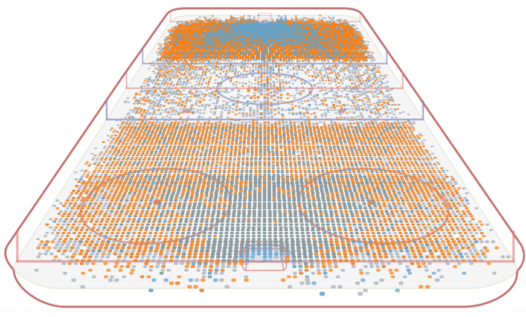

# NHL shot locations in 3D

Showing NHL shot locations in a more appealing and revealing way, using calculations that automatically convert the data from the NHL API to the 3D perspective (see dashboard: https://public.tableau.com/profile/rj7974#!/vizhome/ShotsIn3D/Dashboard2)

Example:

## Let’s start with that we know

### Data

The data from the NHL API that contains shot locations uses the NHL rink dimensions (~ 200 ft by 85 ft) with centre ice being 0,0. This creates the use of negative values (dimensioning the rink -100 to100 and -42.5 to 42.5), but more to come on that later.

### Reference

The underlying[ reference image](https://camo.githubusercontent.com/8462721c88c0653fdb09033f6ad9d0361d7f200d/68747470733a2f2f726a77656973652e6e656f6369746965732e6f72672f496d616765732f336472696e6b322e706e67) I use to project the data onto measures

Black = rink dimensions along length

Purple = image dimensions along length

Green = image dimensions along width

## Process

To keep things manageable, and because they require a different approach, I worked on the X’s (length of the ice) and Y’s (width of the ice) separately.

I started by putting the numbers we know and can measure into a spreadsheet, with separate tabs for the X and Y. Here is the one for X: 

<table>
  <tr>
    <td>Source</td>
    <td>Image (CM)</td>
    <td>Coord%</td>
    <td>Image%</td>
    <td>CalcImg%</td>
  </tr>
  <tr>
    <td>200</td>
    <td>20.5</td>
    <td>100</td>
    <td>100.0</td>
    <td>100.3</td>
  </tr>
  <tr>
    <td>189</td>
    <td>20.1</td>
    <td>94.5</td>
    <td>98.0</td>
    <td>97.7</td>
  </tr>
  <tr>
    <td>125</td>
    <td>17.2</td>
    <td>62.5</td>
    <td>83.9</td>
    <td>83.6</td>
  </tr>
  <tr>
    <td>100</td>
    <td>15.4</td>
    <td>50</td>
    <td>75.1</td>
    <td>75.6</td>
  </tr>
  <tr>
    <td>75</td>
    <td>13.2</td>
    <td>37.5</td>
    <td>64.4</td>
    <td>64.5</td>
  </tr>
  <tr>
    <td>11</td>
    <td>3</td>
    <td>5.5</td>
    <td>14.6</td>
    <td>13.7</td>
  </tr>
  <tr>
    <td>0</td>
    <td>0</td>
    <td>0</td>
    <td>0.0</td>
    <td>0.0</td>
  </tr>
</table>

The source were just X values for known values on the ice (based on rink dimensions): red lines at 11, 100 and 189 ft, blue lines at 75 and 125 ft. I measured those on the Image as well (as we need the "relative spread" the unit of measurement is not relevant, I use cm) and filled out the Image (CM) column.

Assuming the bottom is 0 ft and the top is 200 ft, I can easily calculate the % of total length for both the normal rink dimension (Coord%) and the image (Image%). When I plot this data in Tableau, I can create a function using Trend line which can then be used to calculate the Image% value for any rink dimension value (Coord%):

Formula in Excel: =0.0000999252 * C9^3 + -0.025 * C9^2 + 2.5 * C9 + 0 (C9 holds the rink dimension % value)

In Tableau I can create the rink dimension % value like this: ([X]+100)/2

And then the Image% value uses the formulae like this:

(0.0001 * ([Coord%]^3)) + (-0.025 * ([Coord%]^2)) + (2.5 * ([Coord%])) + 0

If I now take shots from the 2016 season for example, using this formula in the calculated field I get this:

What this is showing? That at 50% of Coord% down the length of the ice (shot X = 0) I am at 75% of the image height (CalcImg%).

To visually check if this is working ciorrectly I plotted the calculated Imag % values and the shot Y values and added the 3D image in the background. I also colour coded the original shot X values per "zone":

This looks good. Now let’s look at the Y values. This is a bit of a different approach, as we want to reduce the width more as we move up on the ice. And where the X value was not influenced by the Y value, the Y value is influenced to the X value. 

To be precise, in the bottom of the image we want Y to be 100% of the Y value, but at the other end of the ice (at the top of the image) we want it to be reduced by a certain percentage. This is what we know for Y:

<table>
  <tr>
    <td>XImage%</td>
    <td>Xsource</td>
    <td>XCoord%</td>
    <td>Yimage(CM)</td>
    <td>Ycoord%</td>
  </tr>
  <tr>
    <td>100</td>
    <td>100</td>
    <td>100</td>
    <td>13.4</td>
    <td>38.3</td>
  </tr>
  <tr>
    <td>75.12195122</td>
    <td>0</td>
    <td>50</td>
    <td>19.5</td>
    <td>55.7</td>
  </tr>
  <tr>
    <td>0</td>
    <td>-100</td>
    <td>0</td>
    <td>35</td>
    <td>100.0</td>
  </tr>
</table>

So over 200 ft of actual length, the width needs to be reduced from 0% at the bottom of the image to 61.7% at the top of the image. In other words the width is 100% of the width Y at the bottom and 38.3% of the width Y at the top. Note we need to use the reference image XImage%. We can plot that again in Tableau:

We can draw a pretty well fitting line through here (R-squared = 0.998692) using -0.610731 * XImage% + 100.317 and after some juggling and realizing that my ruler-on-the-screen measurements may not have been exactly accurate, I adjusted the formula to (-0.72 * [XImage%] + 105).

## That’s an awful long story, but what do we have now?

With the provide formulae, any NHL API shot location can be shown in a more visually appealing 3D format in Tableau:

* Load the data with the shot locations into Tableau

* Create a calculated field called XCoord% to convert the X value to a percentage along the length of the ice, with: ([X]+100)/2

* Create a calculated field called XCalcImg% to convert the CoordX% value to projected value to match the 3D image, with: (0.0001 * ([Coord%]^3)) + (-0.025 * ([Coord%]^2)) + (2.5 * ([Coord%])) + 0

* Create a calculated field called Ycalc to scale the Y value to the image, with: (-0.72 * [CalcImg%] + 105)/100 * [Y]

* Show the shot locations in 3D:

Note that not everybody wants to use this specific image. For using other images in 3D the formulae would have to be recalculated, but other than that everything will work the same as described above.

